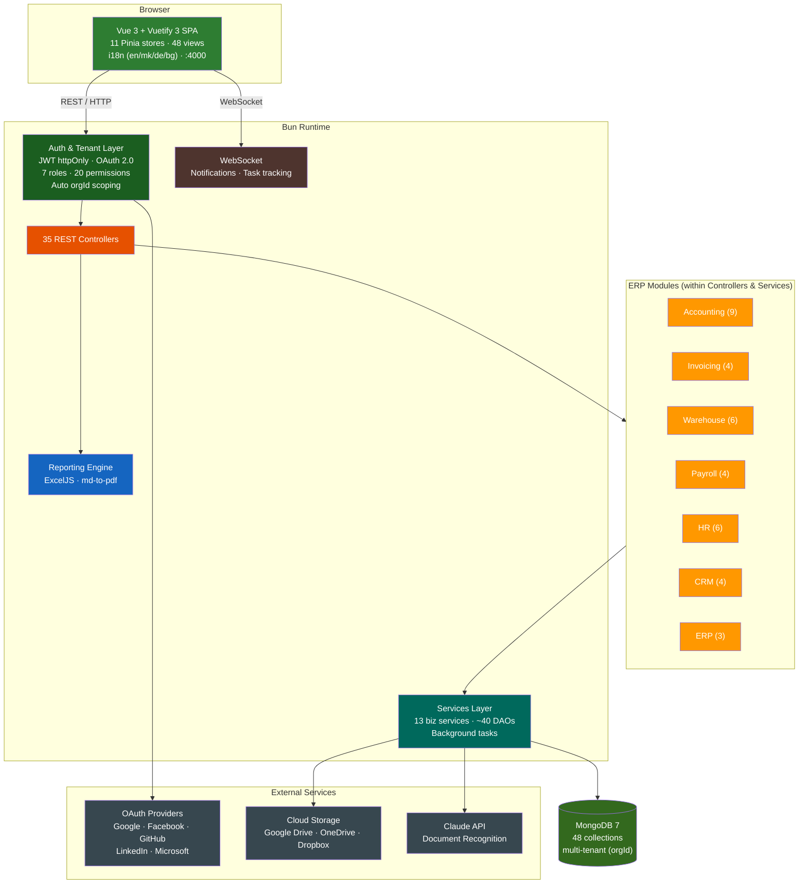

# LGR (Ledger)

Multi-tenant ERP system with 7 business modules, 48 data models, AI document recognition, cloud storage integrations, and comprehensive role-based access control.

## Features

| Category | Feature | Status |
|----------|---------|--------|
| **Accounting** | Chart of Accounts (hierarchical) | :white_check_mark: |
| | Journal Entries with double-entry validation | :white_check_mark: |
| | Fiscal Years & Periods | :white_check_mark: |
| | Fixed Assets with depreciation | :white_check_mark: |
| | Bank Accounts & Reconciliation | :white_check_mark: |
| | Tax Returns, Exchange Rates | :white_check_mark: |
| **Invoicing** | Sales, Purchase, Proforma, Credit Notes | :white_check_mark: |
| | Contacts with addresses | :white_check_mark: |
| | Payment Orders & Cash Orders | :white_check_mark: |
| | Recurring invoices | :white_check_mark: |
| **Warehouse** | Products with variants | :white_check_mark: |
| | Multi-warehouse stock levels | :white_check_mark: |
| | Stock Movements (in/out/transfer) | :white_check_mark: |
| | Inventory Counts, Price Lists | :white_check_mark: |
| **Payroll** | Employee management | :white_check_mark: |
| | Payroll Runs with deductions/contributions | :white_check_mark: |
| | Payslips (earnings, deductions, net) | :white_check_mark: |
| | Timesheets | :white_check_mark: |
| **HR** | Departments, Leave Types/Requests/Balances | :white_check_mark: |
| | Business Trips, Employee Documents | :white_check_mark: |
| **CRM** | Leads, Deals, Pipelines | :white_check_mark: |
| | Activities (call, email, meeting, task) | :white_check_mark: |
| **ERP** | Bill of Materials, Production Orders | :white_check_mark: |
| | Construction Projects (phases, tasks, materials) | :white_check_mark: |
| | Point of Sale (sessions, transactions) | :white_check_mark: |
| **Export** | Excel reports (ExcelJS) | :white_check_mark: |
| | PDF generation (md-to-pdf) | :white_check_mark: |
| **AI** | Document recognition (Claude API) | :white_check_mark: |
| **Cloud Storage** | Google Drive, OneDrive, Dropbox | :white_check_mark: |
| **Auth** | JWT httpOnly cookies + Bearer token | :white_check_mark: |
| | OAuth (Google, Facebook, GitHub, LinkedIn, Microsoft) | :white_check_mark: |
| | Invite system (shareable links, email invites) | :white_check_mark: |
| **Multi-Tenancy** | Automatic `orgId` scoping (tenant plugin) | :white_check_mark: |
| | 7 roles, 20 granular permissions | :white_check_mark: |
| **Real-Time** | WebSocket notifications | :white_check_mark: |
| | Background task tracking | :white_check_mark: |
| **i18n** | English, German, Macedonian, Bulgarian | :white_check_mark: |
| **Theme** | Dark/Light mode (green professional palette) | :white_check_mark: |

## Tech Stack

| Layer | Technology |
|-------|-----------|
| **Runtime** | [Bun](https://bun.sh/) |
| **Backend** | [Elysia.js](https://elysiajs.com/), Mongoose |
| **Database** | MongoDB 7 |
| **Frontend** | Vue 3, Vuetify 3, Pinia, Vue Router |
| **Reporting** | ExcelJS, md-to-pdf |
| **AI** | Claude API (document recognition) |
| **Cloud** | Google Drive, OneDrive, Dropbox |
| **Build** | Bun monorepo, Vite 7 |
| **Testing** | Bun test + mongodb-memory-server, Playwright |
| **Infrastructure** | Docker Compose (MongoDB 7) |

## Architecture



## Quick Start

```bash
# Install dependencies
bun install

# Start MongoDB
docker compose up -d

# Seed database (Acme Corp + Beta Inc)
bun run seed

# Start development servers
bun run dev:api   # API on http://localhost:4001
bun run dev:ui    # UI on http://localhost:4000
```

### Login

| Field | Value |
|-------|-------|
| Organization | `acme-corp` |
| Username | `admin` |
| Password | `test123` |

## ERP Modules

| Module | Models | Views | Description |
|--------|--------|-------|-------------|
| **Accounting** | 9 | 11 | Chart of Accounts, Journal Entries, General Ledger, Financial Statements, Fixed Assets, Bank, Tax |
| **Invoicing** | 4 | 10 | Sales/Purchase/Proforma/Credit Notes, Contacts, Payment Orders, Cash Orders |
| **Warehouse** | 6 | 7 | Products, Multi-warehouse, Stock Levels, Movements, Inventory Counts, Price Lists |
| **Payroll** | 4 | 5 | Employees, Payroll Runs, Payslips, Timesheets |
| **HR** | 6 | 4 | Departments, Leave Management, Business Trips, Employee Documents |
| **CRM** | 4 | 3 | Leads, Deals, Pipeline Management, Activities |
| **ERP** | 5 | 4 | BOM, Production Orders, Construction Projects, Point of Sale |

## Scripts

| Command | Description |
|---------|-------------|
| `bun run dev:api` | Start API with watch mode (port 4001) |
| `bun run dev:ui` | Start Vite dev server (port 4000) |
| `bun run build:ui` | Production UI build |
| `bun run start` | Production API (serves built UI) |
| `bun run seed` | Seed database (Acme Corp + Beta Inc) |
| `bun run test` | Run all integration tests |
| `bun run test:e2e` | Run Playwright E2E tests |

## Documentation

| Document | Description |
|----------|-------------|
| [Architecture](docs/architecture.md) | System overview, package graph, request flow |
| [Data Model](docs/data-model.md) | ER diagram, entity fields and relationships |
| [API Reference](docs/api.md) | All REST endpoints with methods and parameters |
| [Frontend (UI)](docs/ui.md) | Views, routes, Pinia stores, composables |
| [Use Cases](docs/use-cases.md) | Roles, permissions, module workflows |
| [Export & Reporting](docs/export.md) | Excel and PDF generation details |
| [Testing](docs/testing.md) | Test suites, coverage, how to run |
| [Deployment](docs/deployment.md) | Docker, environment variables, seed data, i18n |

## License

ISC
