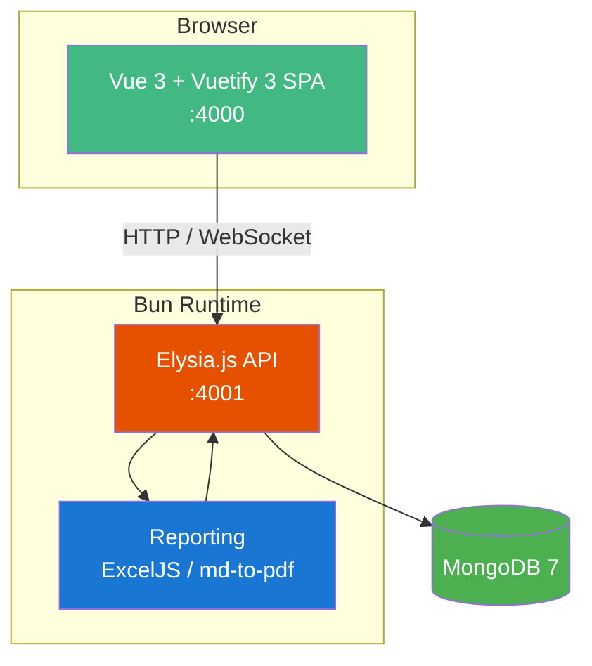
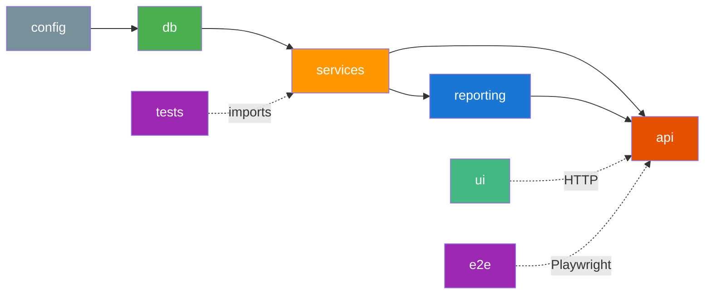
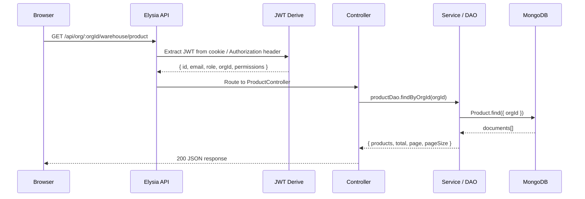
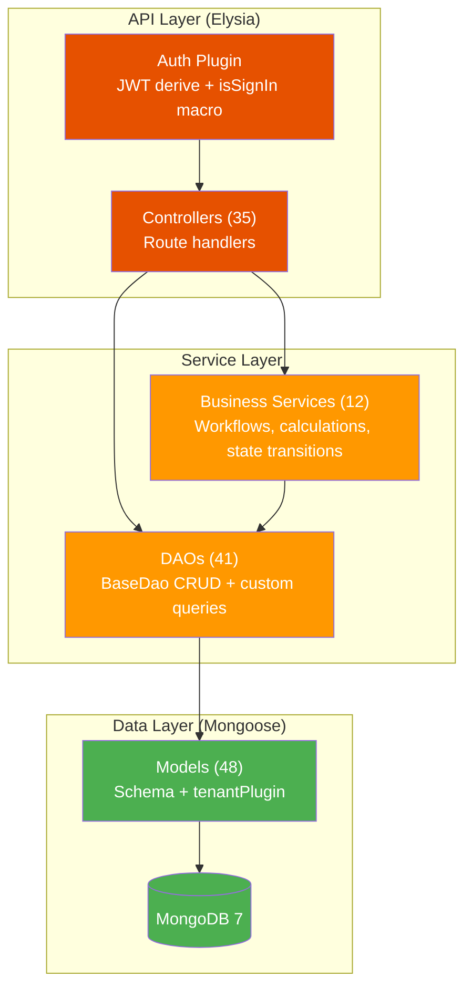
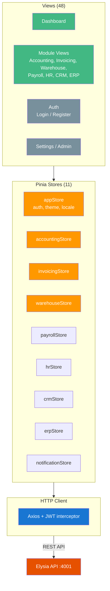

# Architecture

## System Overview

The frontend is a Vue 3 single-page application served by the Elysia.js API in production. During development, Vite serves the frontend on port 4000 and proxies API requests to port 4001.

## Monorepo Package Graph

### Package Responsibilities

| Package | Purpose | Key Dependencies |
|---------|---------|-----------------|
| **config** | Environment variables, constants (roles, permissions, modules, enums) | — |
| **db** | Mongoose models (48), tenant plugin, connection management | config, mongoose |
| **services** | Business logic (biz/), DAOs (dao/), logger, AI recognition | db, pino, @anthropic-ai/sdk |
| **api** | Elysia controllers (35), JWT auth plugin, WebSocket, tenant middleware | services, elysia, @elysiajs/jwt |
| **reporting** | Excel (ExcelJS) and PDF (md-to-pdf) export generators | services, exceljs, md-to-pdf |
| **ui** | Vue 3 + Vuetify 3 frontend with 11 Pinia stores and 48 views | vue, vuetify, pinia, vue-router, axios |
| **tests** | Integration tests with mongodb-memory-server | services, mongodb-memory-server |
| **e2e** | Playwright browser tests against running API | @playwright/test |

## Request Flow

All API requests follow this pattern:
1. JWT token is extracted from the `Authorization: Bearer` header or httpOnly cookie
2. The `isSignIn` macro validates the user is authenticated
3. The controller delegates to a DAO or business service
4. The tenant plugin on each model auto-filters queries by `orgId`

## Backend Layers

### Business Services

| Service | Module | Key Operations |
|---------|--------|---------------|
| `auth.service` | Core | Register (org + user), login, tokenize |
| `accounting.service` | Accounting | Post/void journal entries, trial balance, P&L |
| `invoicing.service` | Invoicing | Record payments, send invoices, overdue checks |
| `warehouse.service` | Warehouse | Confirm movements, adjust stock, stock valuation |
| `payroll.service` | Payroll | Calculate payroll, approve and generate payslips |
| `hr.service` | HR | Submit/approve/reject leave requests |
| `crm.service` | CRM | Convert leads, move deal stages, pipeline summary |
| `erp.service` | ERP | Start/complete production, POS sessions and transactions |
| `currency.service` | Accounting | Exchange rate lookups, amount conversion |
| `file.service` | Core | Upload/delete files with org-scoped storage |
| `ai-recognition.service` | Core | Document recognition via Anthropic Claude |
| `cloud-storage.service` | Core | Google Drive, Dropbox, OneDrive adapters |

## Frontend Layers

The `httpClient` (Axios) automatically:
- Injects the JWT token from `localStorage` into every request
- Redirects to `/auth/login` on 401 responses
- Prefixes all URLs with `/api`

See [Data Model](data-model.md) for entity details, [API Reference](api.md) for endpoints, and [UI](ui.md) for frontend specifics.
