# Data Model

## ER Diagram

```mermaid
erDiagram
    Org ||--o{ User : "has members"
    Org ||--o{ AuditLog : "tracks"
    Org ||--o{ File : "stores"
    Org ||--o{ Notification : "sends"
    Org ||--o{ BackgroundTask : "runs"

    User ||--o{ JournalEntry : "creates"
    User ||--o{ Invoice : "creates"
    User ||--o{ StockMovement : "creates"
    User ||--o{ PayrollRun : "creates"
    User ||--o{ LeaveRequest : "submits"

    Account ||--o{ JournalEntry : "debits/credits"
    FiscalYear ||--o{ FiscalPeriod : "contains"
    BankAccount ||--o{ BankReconciliation : "reconciles"

    Contact ||--o{ Invoice : "billed"
    Contact ||--o{ PaymentOrder : "pays"
    Contact ||--o{ Deal : "linked"
    Invoice ||--o{ StockMovement : "triggers"

    Product ||--o{ StockLevel : "tracked in"
    Product ||--o{ StockMovement : "moved"
    Product ||--o{ BillOfMaterials : "recipe for"
    Warehouse ||--o{ StockLevel : "holds"
    Warehouse ||--o{ StockMovement : "from/to"
    Warehouse ||--o{ POSSession : "sells from"

    Employee ||--o{ Payslip : "receives"
    Employee ||--o{ Timesheet : "logs"
    Employee ||--o{ LeaveRequest : "requests"
    Employee ||--o{ LeaveBalance : "has"
    Employee ||--o{ BusinessTrip : "travels"
    Employee ||--o{ EmployeeDocument : "owns"
    Department ||--o{ Employee : "employs"

    Lead ||--o{ Activity : "has"
    Deal ||--o{ Activity : "has"
    Pipeline ||--o{ Deal : "contains"
    Lead ||--|| Contact : "converts to"

    BillOfMaterials ||--o{ ProductionOrder : "produces"
    ProductionOrder ||--o{ StockMovement : "consumes/outputs"
    ConstructionProject ||--o{ Contact : "client"
    POSSession ||--o{ POSTransaction : "records"
```

## Tenant Plugin

Every model (except `Org`) uses the `tenantPlugin` which:
1. Adds an `orgId` field (ObjectId, required, indexed)
2. Auto-filters all `find`, `findOne`, `countDocuments` queries by `orgId`
3. Ensures data isolation between organizations

## Core Models

### Org

| Field | Type | Constraints | Description |
|-------|------|------------|-------------|
| `name` | String | required | Organization display name |
| `slug` | String | required, unique, lowercase | URL-safe identifier (e.g., `acme-corp`) |
| `ownerId` | ObjectId | required, ref: User | Organization creator |
| `settings` | Object | — | Org-level config (currency, locale, fiscal year start) |
| `subscription` | Object | — | Plan (`free`, `starter`, `professional`, `enterprise`), maxUsers |
| `cloudStorage` | Object | — | Google Drive, Dropbox, OneDrive tokens |
| `isActive` | Boolean | default: true | Soft delete flag |

**Indexes:** `slug` (unique)

### User

| Field | Type | Constraints | Description |
|-------|------|------------|-------------|
| `email` | String | required | User email |
| `username` | String | required | Login username |
| `password` | String | required | Bcrypt/Bun hashed password |
| `firstName` | String | required | First name |
| `lastName` | String | required | Last name |
| `role` | String | required, enum | `admin`, `manager`, `accountant`, `hr_manager`, `warehouse_manager`, `sales`, `member` |
| `permissions` | [String] | — | Granular permission list |
| `orgId` | ObjectId | required, ref: Org | Owning organization |
| `avatar` | String | — | Avatar URL |
| `isActive` | Boolean | default: true | Account status |
| `lastLoginAt` | Date | — | Last successful login |

**Indexes:** `{ orgId, email }` (unique), `{ orgId, username }` (unique)

### AuditLog

| Field | Type | Constraints | Description |
|-------|------|------------|-------------|
| `userId` | ObjectId | required, ref: User | Who performed the action |
| `action` | String | required | Action type (create, update, delete, login) |
| `resource` | String | required | Resource type (e.g., `Invoice`, `Product`) |
| `resourceId` | ObjectId | — | Target document ID |
| `details` | Mixed | — | Change details (before/after) |
| `ipAddress` | String | — | Request IP |

**Indexes:** `{ orgId, createdAt: -1 }`, `{ orgId, resource, action }`

### File

| Field | Type | Constraints | Description |
|-------|------|------------|-------------|
| `originalName` | String | required | Uploaded filename |
| `storagePath` | String | required | Disk path: `uploads/{orgId}/{module}/{year}/{month}` |
| `mimeType` | String | required | MIME type |
| `size` | Number | required | File size in bytes |
| `module` | String | required | Owning module (accounting, invoicing, hr, etc.) |
| `uploadedBy` | ObjectId | required, ref: User | Uploader |
| `metadata` | Mixed | — | AI recognition results, cloud storage refs |

### Notification

| Field | Type | Constraints | Description |
|-------|------|------------|-------------|
| `userId` | ObjectId | required, ref: User | Recipient |
| `type` | String | required | Notification category |
| `title` | String | required | Display title |
| `message` | String | required | Body text |
| `isRead` | Boolean | default: false | Read status |
| `link` | String | — | Navigation link |

### BackgroundTask

| Field | Type | Constraints | Description |
|-------|------|------------|-------------|
| `type` | String | required | Task type |
| `status` | String | required | `pending`, `running`, `completed`, `failed` |
| `progress` | Number | default: 0 | 0–100 percent |
| `result` | Mixed | — | Task output |
| `error` | String | — | Error message if failed |
| `startedAt` | Date | — | Execution start |
| `completedAt` | Date | — | Execution end |

## Accounting Models

### Account (Chart of Accounts)

| Field | Type | Constraints | Description |
|-------|------|------------|-------------|
| `code` | String | required | Account code (e.g., `1000`) |
| `name` | String | required | Account name |
| `type` | String | required, enum | `asset`, `liability`, `equity`, `revenue`, `expense` |
| `subType` | String | enum | `current_asset`, `fixed_asset`, `operating_revenue`, etc. |
| `parentId` | ObjectId | ref: Account | Parent account for hierarchy |
| `balance` | Number | default: 0 | Current balance |
| `currency` | String | required | Account currency |
| `isActive` | Boolean | default: true | Active flag |

**Indexes:** `{ orgId, code }` (unique)

### JournalEntry

| Field | Type | Constraints | Description |
|-------|------|------------|-------------|
| `entryNumber` | String | required | Auto-generated entry number |
| `date` | Date | required | Transaction date |
| `description` | String | required | Entry description |
| `status` | String | default: `draft` | `draft`, `posted`, `voided` |
| `lines` | [Object] | required | Debit/credit lines with `accountId`, `debit`, `credit`, `description` |
| `totalDebit` | Number | required | Sum of all debit amounts |
| `totalCredit` | Number | required | Sum of all credit amounts |
| `fiscalYearId` | ObjectId | ref: FiscalYear | Associated fiscal year |
| `fiscalPeriodId` | ObjectId | ref: FiscalPeriod | Associated period |
| `sourceType` | String | — | Origin (`invoice`, `payroll`, `manual`) |
| `sourceId` | ObjectId | — | Source document reference |
| `postedBy` | ObjectId | ref: User | Who posted the entry |
| `postedAt` | Date | — | When posted |
| `attachments` | [ObjectId] | ref: File | Supporting documents |
| `createdBy` | ObjectId | required, ref: User | Creator |

**Indexes:** `{ orgId, entryNumber }` (unique), `{ orgId, date: -1 }`, `{ orgId, status }`

### FiscalYear / FiscalPeriod

| Model | Key Fields |
|-------|-----------|
| **FiscalYear** | `name`, `startDate`, `endDate`, `status` (`open`, `closed`), `isActive` |
| **FiscalPeriod** | `fiscalYearId` (FK), `name`, `startDate`, `endDate`, `number`, `status` |

### Other Accounting Models

| Model | Key Fields | Indexes |
|-------|-----------|---------|
| **FixedAsset** | `name`, `assetNumber`, `accountId`, `purchaseDate`, `purchasePrice`, `depreciationMethod`, `usefulLifeYears`, `salvageValue`, `accumulatedDepreciation` | `{ orgId, assetNumber }` (unique) |
| **BankAccount** | `name`, `bankName`, `accountNumber`, `iban`, `currency`, `accountId` (FK), `balance` | `{ orgId, accountNumber }` (unique) |
| **BankReconciliation** | `bankAccountId` (FK), `statementDate`, `statementBalance`, `status`, `reconciledItems[]` | `{ orgId, bankAccountId, statementDate }` |
| **TaxReturn** | `type`, `period`, `status`, `taxableAmount`, `taxAmount`, `attachments[]` | `{ orgId, type, 'period.from' }` |
| **ExchangeRate** | `fromCurrency`, `toCurrency`, `rate`, `date`, `source` (`manual`, `api`) | `{ orgId, fromCurrency, toCurrency, date: -1 }` |

## Invoicing Models

### Contact

| Field | Type | Constraints | Description |
|-------|------|------------|-------------|
| `type` | String | required, enum | `customer`, `supplier`, `both` |
| `companyName` | String | — | Company name |
| `firstName` | String | — | Contact first name |
| `lastName` | String | — | Contact last name |
| `email` | String | — | Email address |
| `phone` | String | — | Phone number |
| `taxId` | String | — | Tax identification number |
| `addresses` | [Object] | — | `type`, `street`, `city`, `state`, `postalCode`, `country`, `isDefault` |
| `bankDetails` | [Object] | — | `bankName`, `accountNumber`, `iban`, `swift`, `currency`, `isDefault` |
| `paymentTermsDays` | Number | default: 30 | Default payment terms |
| `accountReceivableId` | ObjectId | ref: Account | AR account link |
| `accountPayableId` | ObjectId | ref: Account | AP account link |

**Indexes:** `{ orgId, type }`, `{ orgId, email }`, `{ orgId, companyName }`, `{ orgId, taxId }`

### Invoice

| Field | Type | Constraints | Description |
|-------|------|------------|-------------|
| `invoiceNumber` | String | required | Auto-generated invoice number |
| `type` | String | required, enum | `invoice`, `proforma`, `credit_note`, `debit_note` |
| `direction` | String | required, enum | `outgoing`, `incoming` |
| `status` | String | default: `draft` | `draft`, `sent`, `partially_paid`, `paid`, `overdue`, `voided`, `cancelled` |
| `contactId` | ObjectId | required, ref: Contact | Bill-to contact |
| `issueDate` | Date | required | Issue date |
| `dueDate` | Date | required | Payment due date |
| `currency` | String | required | Invoice currency |
| `lines` | [Object] | — | `productId`, `description`, `quantity`, `unit`, `unitPrice`, `discount`, `taxRate`, `taxAmount`, `lineTotal`, `accountId` |
| `subtotal` | Number | required | Sum before tax |
| `taxTotal` | Number | required | Total tax |
| `total` | Number | required | Grand total |
| `amountPaid` | Number | default: 0 | Total paid |
| `amountDue` | Number | required | Remaining balance |
| `payments` | [Object] | — | `date`, `amount`, `method`, `reference`, `bankAccountId`, `journalEntryId` |
| `journalEntryId` | ObjectId | ref: JournalEntry | Linked journal entry |
| `createdBy` | ObjectId | required, ref: User | Creator |

**Indexes:** `{ orgId, invoiceNumber }` (unique), `{ orgId, contactId }`, `{ orgId, status }`, `{ orgId, direction, issueDate: -1 }`, `{ orgId, dueDate, status }`

### PaymentOrder / CashOrder

| Model | Key Fields | Indexes |
|-------|-----------|---------|
| **PaymentOrder** | `orderNumber`, `type` (`payment`, `receipt`), `contactId`, `bankAccountId`, `amount`, `currency`, `invoiceIds[]`, `status` (`draft`, `approved`, `executed`, `cancelled`), `journalEntryId` | `{ orgId, orderNumber }` (unique) |
| **CashOrder** | `orderNumber`, `type` (`receipt`, `disbursement`), `contactId`, `amount`, `currency`, `accountId`, `counterAccountId`, `journalEntryId` | `{ orgId, orderNumber }` (unique) |

## Warehouse Models

### Product

| Field | Type | Constraints | Description |
|-------|------|------------|-------------|
| `sku` | String | required | Stock keeping unit |
| `barcode` | String | — | Barcode |
| `name` | String | required | Product name |
| `category` | String | required | Product category |
| `type` | String | required, enum | `goods`, `service`, `raw_material`, `finished_product` |
| `unit` | String | required | Unit of measure |
| `purchasePrice` | Number | default: 0 | Purchase price |
| `sellingPrice` | Number | default: 0 | Selling price |
| `currency` | String | required | Price currency |
| `taxRate` | Number | required | Tax rate percentage |
| `trackInventory` | Boolean | default: true | Enable stock tracking |
| `minStockLevel` | Number | — | Reorder point |
| `maxStockLevel` | Number | — | Maximum stock |

**Indexes:** `{ orgId, sku }` (unique), `{ orgId, barcode }`, `{ orgId, category }`, `{ orgId, name }` (text)

### StockLevel / StockMovement

| Model | Key Fields | Indexes |
|-------|-----------|---------|
| **StockLevel** | `productId` (FK), `warehouseId` (FK), `quantity`, `reservedQuantity`, `availableQuantity`, `avgCost` | `{ orgId, productId, warehouseId }` (unique) |
| **StockMovement** | `movementNumber`, `type` (`receipt`, `dispatch`, `transfer`, `adjustment`, `return`, `production_in`, `production_out`), `status`, `fromWarehouseId`, `toWarehouseId`, `lines[]` (productId, quantity, unitCost), `journalEntryId` | `{ orgId, movementNumber }` (unique) |

### Other Warehouse Models

| Model | Key Fields | Indexes |
|-------|-----------|---------|
| **Warehouse** | `name`, `code`, `type` (`warehouse`, `store`, `production`, `transit`), `managerId`, `isDefault` | `{ orgId, code }` (unique) |
| **InventoryCount** | `countNumber`, `warehouseId`, `date`, `status`, `type` (`full`, `partial`, `cycle`), `lines[]` (productId, systemQuantity, countedQuantity, variance) | `{ orgId, warehouseId, date: -1 }` |
| **PriceList** | `name`, `currency`, `isDefault`, `validFrom`, `validTo`, `items[]` (productId, price, minQuantity, discount) | `{ orgId, name }` (unique) |

## Payroll Models

### Employee

| Field | Type | Constraints | Description |
|-------|------|------------|-------------|
| `employeeNumber` | String | required | Unique employee ID |
| `firstName` | String | required | First name |
| `lastName` | String | required | Last name |
| `department` | String | required | Department name |
| `position` | String | required | Job title |
| `employmentType` | String | required, enum | `full_time`, `part_time`, `contract`, `intern` |
| `status` | String | default: `active` | `active`, `on_leave`, `terminated`, `suspended` |
| `salary` | Object | — | `baseSalary`, `currency`, `frequency`, `hourlyRate`, `bankAccountNumber`, `bankName`, `iban` |
| `deductions` | [Object] | — | `type`, `name`, `amount`, `percentage`, `accountId` |
| `managerId` | ObjectId | ref: Employee | Direct manager |

**Indexes:** `{ orgId, employeeNumber }` (unique), `{ orgId, department }`, `{ orgId, status }`

### Other Payroll Models

| Model | Key Fields | Indexes |
|-------|-----------|---------|
| **PayrollRun** | `name`, `period` (from/to), `status` (`draft`, `calculated`, `approved`, `paid`, `cancelled`), `currency`, `items[]` (employeeId, baseSalary, grossPay, deductions[], netPay, employerContributions[]), `totals`, `journalEntryId` | `{ orgId, 'period.from': -1 }` |
| **Payslip** | `payrollRunId` (FK), `employeeId` (FK), `period`, `earnings[]`, `deductions[]`, `grossPay`, `totalDeductions`, `netPay`, `yearToDate`, `status` (`generated`, `sent`, `paid`) | `{ orgId, employeeId, 'period.from': -1 }` |
| **Timesheet** | `employeeId` (FK), `date`, `hoursWorked`, `overtimeHours`, `type` (`regular`, `overtime`, `holiday`, `sick`, `vacation`), `projectId`, `status` (`submitted`, `approved`, `rejected`) | `{ orgId, employeeId, date: -1 }` |

## HR Models

| Model | Key Fields | Indexes |
|-------|-----------|---------|
| **Department** | `name`, `code`, `parentId` (self-ref), `headId` (FK: Employee), `isActive` | `{ orgId, code }` (unique) |
| **LeaveType** | `name`, `code`, `defaultDays`, `isPaid`, `requiresApproval`, `color` | `{ orgId, code }` (unique) |
| **LeaveRequest** | `employeeId` (FK), `leaveTypeId` (FK), `startDate`, `endDate`, `days`, `halfDay`, `status` (`pending`, `approved`, `rejected`, `cancelled`), `approvedBy` | `{ orgId, employeeId, status }` |
| **LeaveBalance** | `employeeId` (FK), `leaveTypeId` (FK), `year`, `entitled`, `taken`, `pending`, `remaining`, `carriedOver` | `{ orgId, employeeId, leaveTypeId, year }` (unique) |
| **BusinessTrip** | `employeeId` (FK), `destination`, `purpose`, `startDate`, `endDate`, `status`, `expenses[]`, `totalExpenses`, `perDiem` | `{ orgId, employeeId, startDate: -1 }` |
| **EmployeeDocument** | `employeeId` (FK), `type` (`contract`, `amendment`, `id_copy`, `certificate`, `evaluation`, `warning`, `other`), `title`, `fileId` (FK), `isConfidential` | `{ orgId, employeeId, type }` |

## CRM Models

| Model | Key Fields | Indexes |
|-------|-----------|---------|
| **Lead** | `source` (`website`, `referral`, `cold_call`, `email`, `social`, `event`, `other`), `status` (`new`, `contacted`, `qualified`, `unqualified`, `converted`), `contactName`, `estimatedValue`, `assignedTo` (FK: User), `convertedToContactId`, `convertedToDealId` | `{ orgId, status }`, `{ orgId, assignedTo }` |
| **Deal** | `name`, `contactId` (FK), `stage`, `pipelineId` (FK), `value`, `currency`, `probability`, `expectedCloseDate`, `status` (`open`, `won`, `lost`), `assignedTo` (FK: User), `products[]` | `{ orgId, pipelineId, stage }`, `{ orgId, status, expectedCloseDate }` |
| **Pipeline** | `name`, `stages[]` (`name`, `order`, `probability`, `color`), `isDefault`, `isActive` | `{ orgId, name }` (unique) |
| **Activity** | `type` (`call`, `email`, `meeting`, `task`, `note`, `follow_up`), `subject`, `contactId`, `dealId`, `leadId`, `assignedTo` (FK: User), `dueDate`, `status` (`pending`, `completed`, `cancelled`), `priority` (`low`, `medium`, `high`) | `{ orgId, assignedTo, status, dueDate }` |

## ERP Models

| Model | Key Fields | Indexes |
|-------|-----------|---------|
| **BillOfMaterials** | `productId` (FK), `name`, `version`, `status` (`draft`, `active`, `obsolete`), `materials[]` (productId, quantity, unit, wastagePercent, cost), `laborHours`, `laborCostPerHour`, `overheadCost`, `totalCost` | `{ orgId, productId }` |
| **ProductionOrder** | `orderNumber`, `bomId` (FK), `productId` (FK), `quantity`, `warehouseId`, `outputWarehouseId`, `status` (`planned`, `in_progress`, `quality_check`, `completed`, `cancelled`), `priority`, `stages[]`, `materialsConsumed[]`, `quantityProduced`, `quantityDefective`, `totalCost` | `{ orgId, orderNumber }` (unique) |
| **ConstructionProject** | `projectNumber`, `name`, `clientId` (FK: Contact), `status` (`planning`, `active`, `on_hold`, `completed`, `cancelled`), `budget` (estimated, approved, spent, remaining), `phases[]`, `team[]` (employeeId, role), `materials[]`, `totalInvoiced`, `margin` | `{ orgId, projectNumber }` (unique) |
| **POSSession** | `warehouseId` (FK), `cashierId` (FK: User), `sessionNumber`, `status` (`open`, `closed`), `openingBalance`, `closingBalance`, `totalSales`, `totalReturns`, `transactionCount` | `{ orgId, cashierId, openedAt: -1 }` |
| **POSTransaction** | `sessionId` (FK), `transactionNumber`, `type` (`sale`, `return`, `exchange`), `customerId` (FK: Contact), `lines[]`, `subtotal`, `taxTotal`, `total`, `payments[]` (method, amount), `changeDue`, `invoiceId`, `movementId` | `{ orgId, transactionNumber }` (unique) |

## Population Strategy

Models use Mongoose `.populate()` to resolve references at query time:

| Endpoint | Populated Fields |
|----------|-----------------|
| GET Invoice | `contactId` → Contact name and details |
| GET Deal | `contactId` → Contact, `pipelineId` → Pipeline |
| GET Production Order | `bomId` → BOM, `productId` → Product |
| GET Construction Project | `clientId` → Contact |
| GET Leave Request | `employeeId` → Employee, `leaveTypeId` → LeaveType |

All models include `timestamps: true` which adds `createdAt` and `updatedAt` fields automatically.

See [Architecture](architecture.md) for system design and [API Reference](api.md) for endpoint details.
