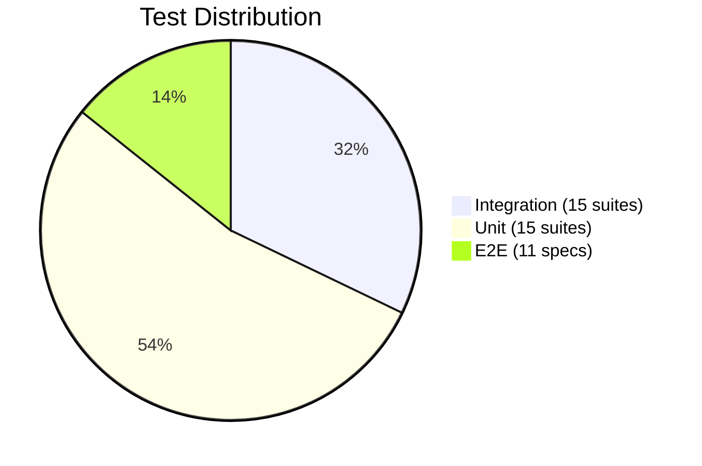
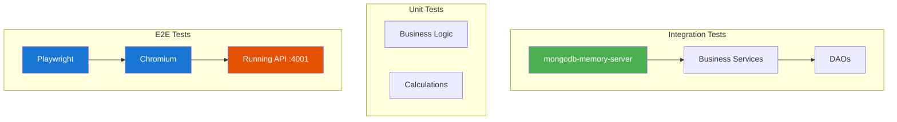

# Testing

## Test Distribution



**Total: 280+ automated tests** covering all ERP modules.

## Integration Tests

Integration tests run against **mongodb-memory-server** for full data isolation per test run.

```bash
# Run all integration tests
bun run test

# Run single test file
bun test packages/tests/src/integration/auth.flow.test.ts
```

### Test Setup

| Helper | Purpose |
|--------|---------|
| `setupTestDB()` | Creates in-memory MongoDB with connection pooling |
| `teardownTestDB()` | Disconnects and stops memory server |
| `clearCollections()` | Deletes all documents from all collections |
| `createTest*()` | Factory functions for test data (org, user, contact, invoice, product, etc.) |

### Integration Test Suites

| File | Tests | Description |
|------|-------|-------------|
| `auth.flow.test.ts` | 8 | Registration, login, JWT payload, duplicate prevention, multi-tenancy isolation |
| `multi-tenancy.test.ts` | 6 | Data isolation between orgs (contacts, invoices, employees, stock, CRM) |
| `permission-auth.flow.test.ts` | 7 | Role-based access: admin, accountant, hr_manager, warehouse_manager, sales, member |
| `accounting.flow.test.ts` | 3 | Journal entry posting, trial balance, unbalanced entry rejection |
| `invoicing.flow.test.ts` | 5 | Send invoice, full/partial payment, overdue detection, total calculation |
| `invoice-to-accounting.flow.test.ts` | 8 | Payment → journal entry → account balances, credit notes, multi-currency |
| `warehouse.flow.test.ts` | 6 | Stock adjustment, weighted avg cost, receipt/transfer confirmation |
| `payroll.flow.test.ts` | 6 | Payroll calculation, deductions, approval, payslip generation |
| `hr.flow.test.ts` | 6 | Department hierarchy, leave submit/approve/reject, balance tracking |
| `crm.flow.test.ts` | 6 | Lead conversion, deal stage movement, pipeline summary |
| `erp.flow.test.ts` | 6 | Production start/complete, POS session open/close/transaction |
| `bom-production.flow.test.ts` | 7 | BOM cost calculation, production order lifecycle, material consumption |
| `construction-project.flow.test.ts` | 7 | Project phases, team, materials, budget tracking, margin calculation |
| `reporting.flow.test.ts` | 8 | Trial balance, P&L, period filtering, non-posted exclusion |

## Unit Tests

Unit tests validate isolated business logic, calculations, and formulas.

```bash
# Run all unit tests
bun test packages/tests/src/unit/

# Run specific suite
bun test packages/tests/src/unit/biz/accounting-posting.test.ts
```

### Business Logic Tests

| File | Tests | Description |
|------|-------|-------------|
| `biz/accounting-posting.test.ts` | 32 | postJournalEntry, voidJournalEntry, getTrialBalance, getProfitLoss |
| `biz/warehouse-stock.test.ts` | 18 | adjustStock, confirmMovement, getStockValuation, weighted avg cost |
| `biz/payroll-calc.test.ts` | 25 | calculatePayroll, approvePayroll, deductions, employer contributions |
| `biz/invoicing-payments.test.ts` | — | Payment processing, invoice totals, status transitions |
| `biz/hr-leave.test.ts` | — | Leave balance calculations, submit/approve/reject |
| `biz/crm-pipeline.test.ts` | — | Deal probability, stage weighting, pipeline summary |
| `biz/erp-pos.test.ts` | — | POS transaction calculations, session totals |

### DAO Tests

| File | Tests | Description |
|------|-------|-------------|
| `dao/core.dao.test.ts` | — | Generic CRUD operations (findAll, create, update, delete) |
| `dao/accounting.dao.test.ts` | — | Account queries, trial balance data fetching |
| `dao/invoicing.dao.test.ts` | — | Invoice filtering, payment history |
| `dao/warehouse.dao.test.ts` | — | Stock level queries, movement history |
| `dao/hr.dao.test.ts` | — | Employee, leave balance queries |
| `dao/payroll.dao.test.ts` | — | Payroll run, payslip queries |
| `dao/crm.dao.test.ts` | — | Lead, deal, pipeline queries |
| `dao/erp.dao.test.ts` | — | Production order, BOM queries |

## E2E Tests

E2E tests use **Playwright** against a running API at `http://localhost:4001`.

```bash
# Run all E2E tests
bun run test:e2e

# Run single spec
cd packages/e2e && bunx playwright test tests/warehouse.spec.ts

# Run headed (visible browser)
cd packages/e2e && bunx playwright test --headed

# Debug mode
cd packages/e2e && bunx playwright test --debug
```

### Playwright Configuration

| Setting | Value |
|---------|-------|
| Base URL | `http://localhost:4001` |
| Browser | Chromium |
| Workers | 4 (local), 1 (CI) |
| Retries | 1 (local), 2 (CI) |
| Test timeout | 30 seconds |
| Action timeout | 10 seconds |
| Screenshots | On failure only |
| Traces | On first retry |
| Web server | Auto-starts `bun run start` |

### E2E Test Specs

| File | Tests | Description |
|------|-------|-------------|
| `auth.spec.ts` | 6 | Login page, valid/invalid login, redirect, register page |
| `dashboard.spec.ts` | 5 | KPI cards, quick actions, navigation, no errors |
| `navigation.spec.ts` | 7 | Sidebar links, module navigation, drawer toggle, theme toggle, logout |
| `accounting.spec.ts` | — | Chart of accounts, journal entries, financial statements |
| `invoicing.spec.ts` | — | Contacts, invoices, payment recording |
| `warehouse.spec.ts` | — | Products, stock levels, movements |
| `payroll.spec.ts` | — | Employees, payroll runs, timesheets |
| `hr.spec.ts` | — | Departments, leave management |
| `crm.spec.ts` | — | Leads, deals, activities |
| `erp.spec.ts` | — | BOM, production orders, POS |
| `settings.spec.ts` | — | Organization settings, user management |

### E2E Helpers

| Helper | Purpose |
|--------|---------|
| `loginAsAdmin(page)` | Login with seeded admin credentials (`acme-corp` / `admin` / `test123`) |
| `loginAs(page, org, username, password)` | Login with custom credentials |

### Vuetify Testing Tips

For `v-select` components, use `getByRole('combobox', { name: /label/i })` instead of `getByLabel()` — the clearable icon causes Playwright strict mode violations.

## Test Architecture



### Key Testing Patterns

- **Multi-tenancy isolation** — Every integration test validates org data isolation
- **State machine verification** — Tests cover complete status transitions (draft → posted, planned → completed)
- **Financial accuracy** — Accounting tests verify debit = credit, correct balance updates
- **Error rejection** — All tests include negative cases (invalid input, wrong state, insufficient data)

See [Deployment](deployment.md) for test environment configuration and [Architecture](architecture.md) for the system overview.
