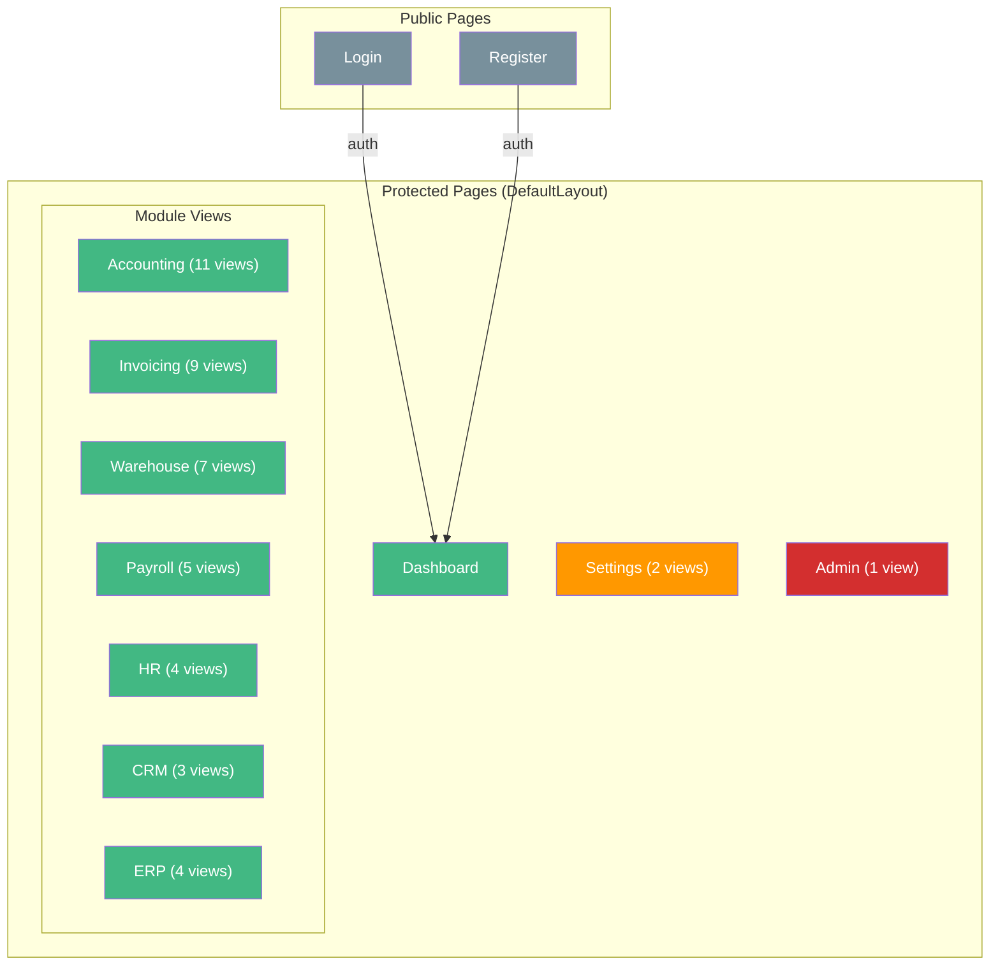
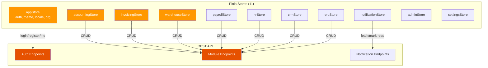

# Frontend (UI)

## Page Map

## Routes

### Auth (Public)

| Path | Name | View | Description |
|------|------|------|-------------|
| `/auth/login` | `auth.login` | LoginView | Organization slug + username + password login |
| `/auth/register` | `auth.register` | RegisterView | Create new organization and admin user |

### Dashboard

| Path | Name | View | Description |
|------|------|------|-------------|
| `/` | — | — | Redirect to `/dashboard` |
| `/dashboard` | `dashboard` | DashboardView | KPI cards, quick actions, recent activity |

### Accounting

| Path | Name | View | Description |
|------|------|------|-------------|
| `/accounting/accounts` | `accounting.accounts` | AccountsView | Chart of accounts |
| `/accounting/journal-entries` | `accounting.journal-entries` | JournalEntriesView | Journal entry list |
| `/accounting/journal-entries/new` | `accounting.journal-entries.new` | JournalEntryFormView | Create journal entry |
| `/accounting/journal-entries/:id` | `accounting.journal-entries.edit` | JournalEntryFormView | Edit journal entry |
| `/accounting/general-ledger` | `accounting.general-ledger` | GeneralLedgerView | General ledger report |
| `/accounting/financial-statements` | `accounting.financial-statements` | FinancialStatementsView | Trial balance, P&L, balance sheet |
| `/accounting/fixed-assets` | `accounting.fixed-assets` | FixedAssetsView | Fixed asset register |
| `/accounting/bank-accounts` | `accounting.bank-accounts` | BankAccountsView | Bank account management |
| `/accounting/reconciliation` | `accounting.reconciliation` | ReconciliationView | Bank reconciliation |
| `/accounting/tax-returns` | `accounting.tax-returns` | TaxReturnsView | Tax filing tracking |
| `/accounting/exchange-rates` | `accounting.exchange-rates` | ExchangeRatesView | Currency exchange rates |

### Invoicing

| Path | Name | View | Description |
|------|------|------|-------------|
| `/invoicing/sales` | `invoicing.sales` | SalesInvoicesView | Sales invoice list |
| `/invoicing/sales/new` | `invoicing.sales.new` | InvoiceFormView | Create sales invoice |
| `/invoicing/sales/:id` | `invoicing.sales.edit` | InvoiceFormView | Edit sales invoice |
| `/invoicing/purchases` | `invoicing.purchases` | PurchaseInvoicesView | Purchase invoice list |
| `/invoicing/proforma` | `invoicing.proforma` | ProformaInvoicesView | Proforma invoices |
| `/invoicing/credit-notes` | `invoicing.credit-notes` | CreditNotesView | Credit notes |
| `/invoicing/payment-orders` | `invoicing.payment-orders` | PaymentOrdersView | Payment orders |
| `/invoicing/cash-orders` | `invoicing.cash-orders` | CashOrdersView | Cash orders |
| `/invoicing/contacts` | `invoicing.contacts` | ContactsView | Customer/supplier directory |
| `/invoicing/contacts/new` | `invoicing.contacts.new` | ContactFormView | Create contact |
| `/invoicing/contacts/:id` | `invoicing.contacts.edit` | ContactFormView | Edit contact |

### Warehouse

| Path | Name | View | Description |
|------|------|------|-------------|
| `/warehouse/products` | `warehouse.products` | ProductsView | Product catalog |
| `/warehouse/products/new` | `warehouse.products.new` | ProductFormView | Create product |
| `/warehouse/products/:id` | `warehouse.products.edit` | ProductFormView | Edit product |
| `/warehouse/warehouses` | `warehouse.warehouses` | WarehousesView | Warehouse locations |
| `/warehouse/stock-levels` | `warehouse.stock-levels` | StockLevelsView | Current stock levels |
| `/warehouse/movements` | `warehouse.movements` | MovementsView | Stock movement list |
| `/warehouse/inventory-count` | `warehouse.inventory-count` | InventoryCountView | Physical inventory counts |
| `/warehouse/price-lists` | `warehouse.price-lists` | PriceListsView | Price list configurations |

### Payroll

| Path | Name | View | Description |
|------|------|------|-------------|
| `/payroll/employees` | `payroll.employees` | EmployeesView | Employee master list |
| `/payroll/employees/new` | `payroll.employees.new` | EmployeeFormView | Create employee |
| `/payroll/employees/:id` | `payroll.employees.edit` | EmployeeFormView | Edit employee |
| `/payroll/runs` | `payroll.runs` | PayrollRunsView | Payroll batch processing |
| `/payroll/payslips` | `payroll.payslips` | PayslipsView | Payslip viewer |
| `/payroll/timesheets` | `payroll.timesheets` | TimesheetsView | Timesheet tracking |

### HR

| Path | Name | View | Description |
|------|------|------|-------------|
| `/hr/departments` | `hr.departments` | DepartmentsView | Department hierarchy |
| `/hr/leave-management` | `hr.leave-management` | LeaveManagementView | Leave requests and approval |
| `/hr/business-trips` | `hr.business-trips` | BusinessTripsView | Business trip tracking |
| `/hr/documents` | `hr.documents` | EmployeeDocumentsView | Employee documents |

### CRM

| Path | Name | View | Description |
|------|------|------|-------------|
| `/crm/leads` | `crm.leads` | LeadsView | Sales lead management |
| `/crm/deals` | `crm.deals` | DealsView | Deal pipeline board |
| `/crm/activities` | `crm.activities` | ActivitiesView | Activity log |

### ERP

| Path | Name | View | Description |
|------|------|------|-------------|
| `/erp/bom` | `erp.bom` | BillOfMaterialsView | Bill of materials |
| `/erp/production` | `erp.production` | ProductionOrdersView | Production orders |
| `/erp/construction` | `erp.construction` | ConstructionProjectsView | Construction projects |
| `/erp/pos` | `erp.pos` | POSView | Point of sale |

### Settings & Admin

| Path | Name | View | Description |
|------|------|------|-------------|
| `/settings/organization` | `settings.organization` | OrganizationView | Organization profile |
| `/settings/users` | `settings.users` | UsersView | User management |
| `/admin/audit-log` | `admin.audit-log` | AuditLogView | System audit trail |

## Authentication Guard

The router `beforeEach` hook checks:
1. If route has `meta.public: true` → allow access
2. If `lgr_token` exists in `localStorage` → allow access
3. Otherwise → redirect to `auth.login`

## Layouts

| Layout | Used For | Features |
|--------|----------|----------|
| **DefaultLayout** | All protected routes | Sidebar navigation, top app bar, notification bell |
| **AuthLayout** | Login, Register | Minimal centered form layout |

## State Management

### appStore

| State | Type | Description |
|-------|------|-------------|
| `token` | String | JWT token from localStorage |
| `user` | Object | Current user profile |
| `currentOrg` | Object | Current organization |
| `leftDrawer` | Boolean | Sidebar visibility |
| `locale` | `'en'` \| `'mk'` \| `'de'` | Active locale |
| `theme` | `'light'` \| `'dark'` | Active theme |

**Getters:** `isAuth`, `isDark`, `orgId`, `fullName`, `initials`

**Actions:** `login`, `register`, `logout`, `fetchProfile`, `setTheme`, `toggleTheme`, `setLocale`, `toggleDrawer`

### accountingStore

| State | Type | Description |
|-------|------|-------------|
| `accounts` | Array | Chart of accounts |
| `journalEntries` | Array | Journal entries |
| `fiscalYears` | Array | Fiscal years |
| `fiscalPeriods` | Array | Fiscal periods |
| `fixedAssets` | Array | Fixed assets |
| `bankAccounts` | Array | Bank accounts |
| `reconciliations` | Array | Reconciliations |
| `taxReturns` | Array | Tax returns |
| `exchangeRates` | Array | Exchange rates |
| `trialBalance` | Array | Trial balance data |

**Getters:** `activeAccounts`, `totalDebits`, `totalCredits`, `draftEntries`

**Actions:** CRUD for each entity, `postJournalEntry`, `voidJournalEntry`, `getTrialBalance`, `getProfitLoss`, `getBalanceSheet`

### invoicingStore

| State | Type | Description |
|-------|------|-------------|
| `contacts` | Array | Customer/supplier contacts |
| `invoices` | Array | Invoices |
| `paymentOrders` | Array | Payment orders |
| `cashOrders` | Array | Cash orders |

**Getters:** `overdueInvoices`, `totalOutstanding`, `activeContacts`, `customers`, `suppliers`

**Actions:** CRUD for each entity, `sendInvoice`, `recordPayment`

### warehouseStore

| State | Type | Description |
|-------|------|-------------|
| `products` | Array | Products |
| `warehouses` | Array | Warehouses |
| `stockLevels` | Array | Stock levels |
| `stockMovements` | Array | Stock movements |
| `inventoryCounts` | Array | Inventory counts |
| `priceLists` | Array | Price lists |

**Getters:** `activeProducts`, `activeWarehouses`, `lowStockProducts`

**Actions:** CRUD for each entity, `confirmMovement`, `getStockValuation`

### payrollStore

| State | Type | Description |
|-------|------|-------------|
| `employees` | Array | Employees |
| `payrollRuns` | Array | Payroll runs |
| `payslips` | Array | Payslips |
| `timesheets` | Array | Timesheets |

**Getters:** `activeEmployees`, `pendingPayrollRuns`, `totalPayrollCost`

**Actions:** CRUD for each entity, `calculatePayroll`, `approvePayroll`

### hrStore

| State | Type | Description |
|-------|------|-------------|
| `departments` | Array | Departments |
| `leaveTypes` | Array | Leave types |
| `leaveRequests` | Array | Leave requests |
| `leaveBalances` | Array | Leave balances |
| `businessTrips` | Array | Business trips |
| `employeeDocuments` | Array | Employee documents |

**Getters:** `activeDepartments`, `pendingLeaveRequests`, `activeTrips`

**Actions:** CRUD for each entity, `approveLeave`, `rejectLeave`

### crmStore

| State | Type | Description |
|-------|------|-------------|
| `leads` | Array | Sales leads |
| `deals` | Array | Deals |
| `pipelines` | Array | Pipelines |
| `activities` | Array | Activities |
| `pipelineSummary` | Object | Pipeline report data |

**Getters:** `openDeals`, `totalPipelineValue`, `weightedPipelineValue`, `newLeads`, `pendingActivities`

**Actions:** CRUD for each entity, `convertLead`, `moveDealStage`, `completeActivity`, `fetchPipelineSummary`

### erpStore

| State | Type | Description |
|-------|------|-------------|
| `boms` | Array | Bills of materials |
| `productionOrders` | Array | Production orders |
| `constructionProjects` | Array | Construction projects |
| `posSessions` | Array | POS sessions |
| `posTransactions` | Array | POS transactions |

**Getters:** `activeBOMs`, `activeProductionOrders`, `activeProjects`, `openPOSSessions`

**Actions:** CRUD for each entity, `startProduction`, `completeProduction`, `openPOSSession`, `closePOSSession`

### notificationStore

| State | Type | Description |
|-------|------|-------------|
| `notifications` | Array | Notification records |

**Getters:** `unreadCount`, `unreadNotifications`

**Actions:** `fetchNotifications`, `markAsRead`, `markAllAsRead`, `addNotification` (from WebSocket)

## Composables

### useHttpClient

Creates an Axios instance with:
- Base URL: `/api`
- Request interceptor: injects `Authorization: Bearer {token}` from localStorage
- Response interceptor: on 401 clears token and redirects to `/auth/login`

### useWebSocket

Real-time connection for notifications and background task updates.
- Connects to `ws[s]://{host}/ws/tasks?userId={userId}`
- Ping/pong keepalive every 30 seconds
- Exponential backoff reconnect (max 10 attempts, up to 30s delay)
- `onMessage(handler)` / `removeHandler(handler)` for subscriptions

### useCurrency

Currency formatting utilities supporting 19 currencies.
- `formatCurrency(amount, currency, locale)` — uses `Intl.NumberFormat`
- `parseCurrency(value)` — strips non-numeric characters
- `getCurrencySymbol(currency)` — returns symbol (e.g., EUR → `€`, MKD → `ден`)

## Shared Components

| Component | Purpose |
|-----------|---------|
| **DataTable** | Reusable data table with sorting and pagination |
| **CurrencyInput** | Input field with currency symbol formatting |
| **ExportMenu** | Export to Excel/PDF menu button |
| **FileUpload** | File upload with drag-and-drop |
| **NotificationBell** | Notification icon with unread count badge |
| **AuditTrail** | Audit log timeline display |

## Plugin Setup Order

Registration order in `plugins/index.ts` is **critical**:

1. **i18n** (vue-i18n) — must be first, vuetify locale adapter depends on it
2. **vuetify** (createVuetify) — material design components
3. **pinia** (createPinia) — state management
4. **router** (vue-router) — navigation

## Internationalization

Supported locales: **EN**, **MK**, **DE**

Locale resolution:
1. Check `localStorage` for saved `lgr_locale`
2. Fall back to browser language (`navigator.language`)
3. Default to `en`

Vuetify's `$vuetify.*` locale keys are merged into i18n messages. Macedonian uses English fallback for Vuetify strings.

See [Architecture](architecture.md) for the full system overview and [API Reference](api.md) for backend endpoints.
