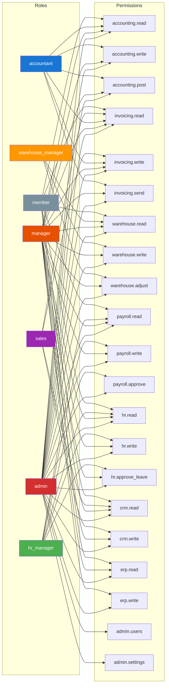
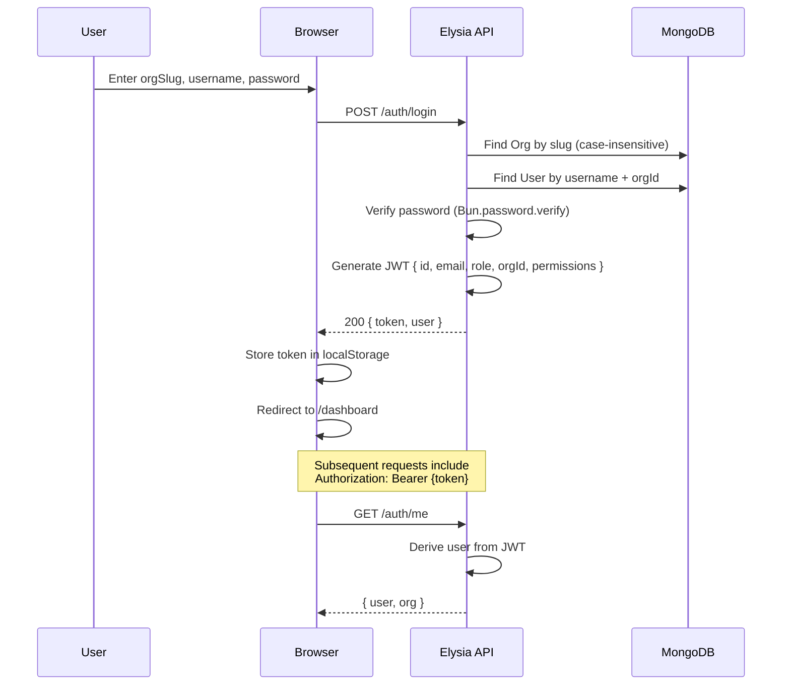
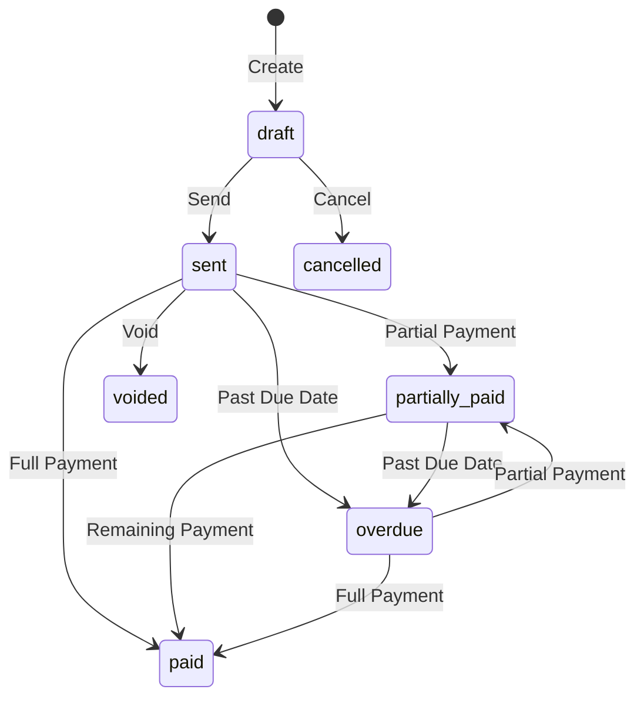
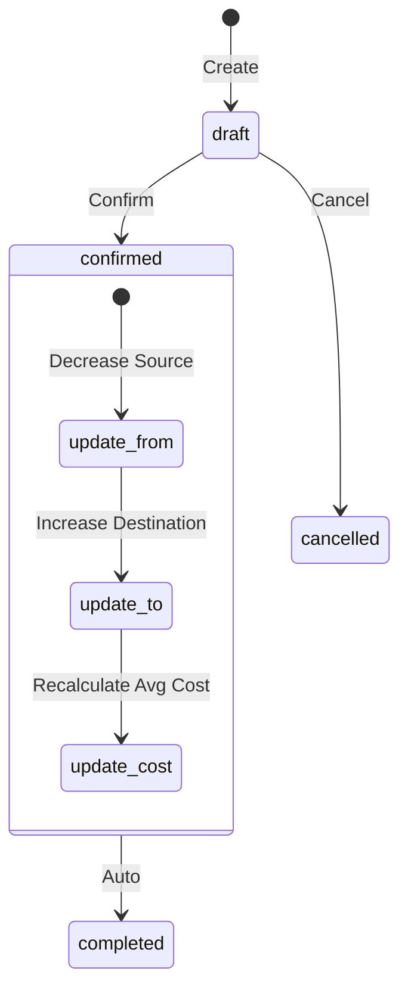
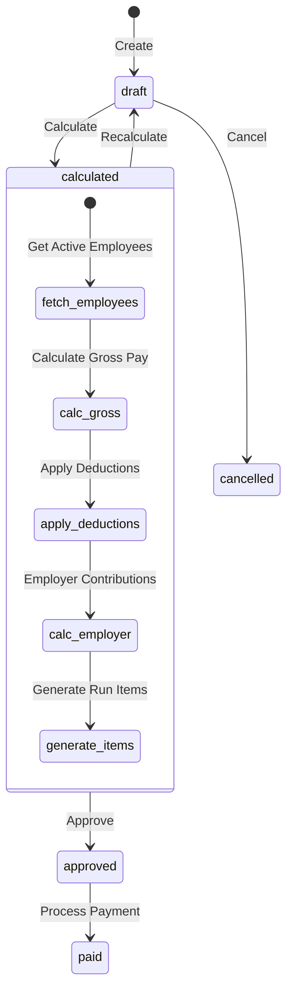
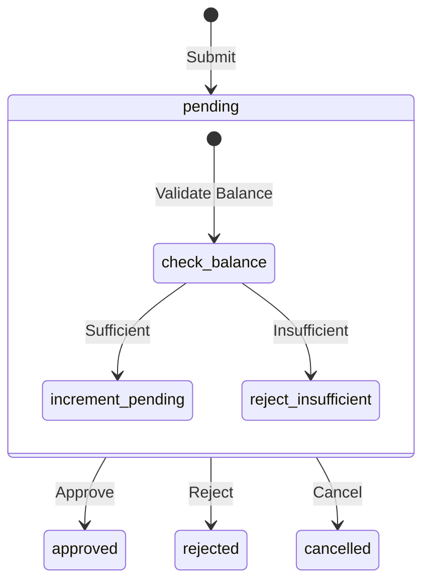
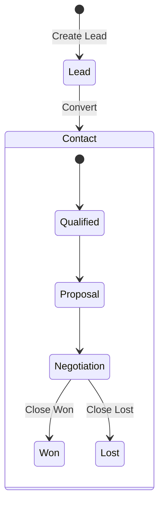
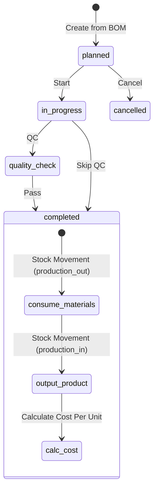
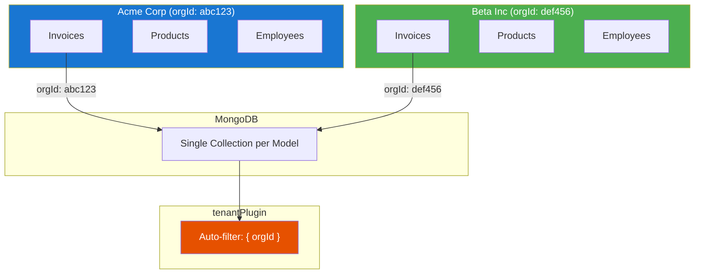

# Use Cases

## User Roles & Permissions

### Permission Matrix

| Resource | admin | manager | accountant | hr_manager | warehouse_manager | sales | member |
|----------|-------|---------|------------|------------|-------------------|-------|--------|
| **Accounting** | read, write, post | read, write, post | read, write, post | — | — | — | read |
| **Invoicing** | read, write, send | read, write, send | read, write, send | — | — | read, write | read |
| **Warehouse** | read, write, adjust | read, write, adjust | — | — | read, write, adjust | — | read |
| **Payroll** | read, write, approve | read, write | — | read, write, approve | — | — | read |
| **HR** | read, write, approve_leave | read, write, approve_leave | — | read, write, approve_leave | — | — | read |
| **CRM** | read, write | read, write | — | — | — | read, write | read |
| **ERP** | read, write | read, write | — | — | — | — | read |
| **Admin** | users, settings | — | — | — | — | — | — |

## Authentication Flow

## Module Workflows

### Invoice Lifecycle

**Key operations:**
- **Create** — Draft invoice with lines, auto-generated number
- **Send** — Transition draft → sent, records `sentAt`
- **Record Payment** — Updates `amountPaid`, creates payment entry
- **Overdue Check** — Background scan for invoices past `dueDate`
- **Invoice → Journal Entry** — Posts accounting entry on payment

### Stock Movement Flow

**Movement types:**
- **Receipt** — Goods arriving at `toWarehouseId`
- **Dispatch** — Goods leaving `fromWarehouseId`
- **Transfer** — Between two warehouses
- **Adjustment** — Inventory corrections
- **Return** — Customer/supplier returns
- **Production In/Out** — Manufacturing material consumption and output

### Payroll Run Workflow

**Key operations:**
- **Calculate** — Generates payroll items for all active employees with base salary, deductions, and employer contributions
- **Approve** — Requires admin/hr_manager role, auto-generates individual payslips
- **Payslip** — Contains earnings breakdown, deductions, net pay, and year-to-date totals

### Leave Request Flow

**Balance tracking:**
- Submit: `pending += days`
- Approve: `pending -= days`, `taken += days`, `remaining -= days`
- Reject/Cancel: `pending -= days` (restore)

### Deal Pipeline

**CRM workflow:**
- **Lead** → Created from source (website, referral, cold call, etc.)
- **Convert** → Creates Contact (type: customer) + optional Deal
- **Deal Stages** → Defined by Pipeline with `name`, `order`, `probability`, `color`
- **Pipeline Summary** → Aggregates deals by stage with count, total value, and weighted value

### Production Order

**Key operations:**
- **BOM** defines materials, labor hours, overhead cost
- **Start** transitions planned → in_progress
- **Complete** creates stock movements for material consumption and finished goods output
- **Quality Checks** tracked per production stage

## Multi-Tenant Data Flow

Every query is automatically scoped by `orgId` through the Mongoose tenant plugin. Users can only access data belonging to their organization. The `orgId` is derived from the JWT token and the `:orgId` URL parameter, with validation ensuring they match.

See [Data Model](data-model.md) for entity schemas and [API Reference](api.md) for endpoint details.
